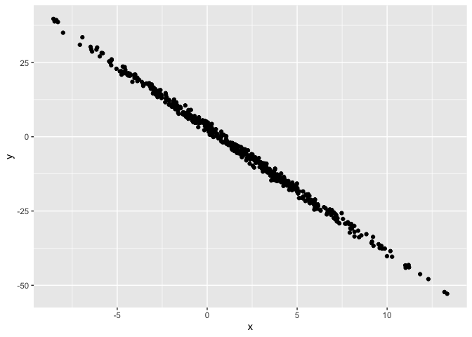
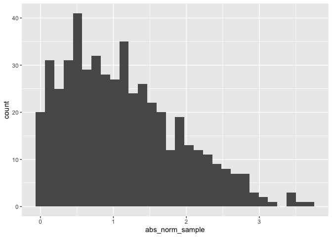

Simple document
================

I’m an R Markdown document!

# Section 1

Here’s a **code chunk** that samples from a *normal distribution*:

``` r
samp = rnorm(100)
length(samp)
```

    ## [1] 100

# Section 2

I can take the mean of the sample, too! The mean is -0.0443309.

# Section 3

This is going to be a plot

``` r
library(tidyverse)
```

    ## ── Attaching packages ─────────────────────────────────────── tidyverse 1.3.2 ──
    ## ✔ ggplot2 3.3.6     ✔ purrr   0.3.4
    ## ✔ tibble  3.1.8     ✔ dplyr   1.0.9
    ## ✔ tidyr   1.2.0     ✔ stringr 1.4.1
    ## ✔ readr   2.1.2     ✔ forcats 0.5.2
    ## ── Conflicts ────────────────────────────────────────── tidyverse_conflicts() ──
    ## ✖ dplyr::filter() masks stats::filter()
    ## ✖ dplyr::lag()    masks stats::lag()

``` r
plot_df = tibble(
  x = rnorm(500, mean=2, sd=4),
  y = 3 - 4.2*x + rnorm(500)
)

ggplot(plot_df,aes(x = x,y = y)) + geom_point()
```

<!-- -->

<!-- -->
I have applied echo=FALSE and message=FALSE

# Section 3

## In-class homework (practice)

    ## `stat_bin()` using `bins = 30`. Pick better value with `binwidth`.

<!-- --> The median
of the variable containing absolute values is

0.94
